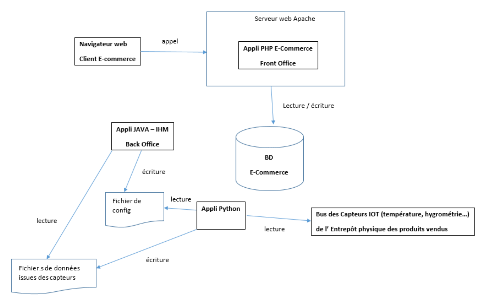
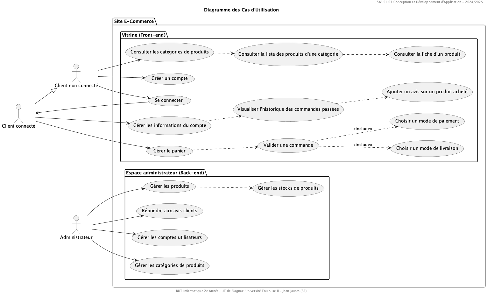

= Document de conception
:compat-mode!:
:toc:
:toc-title: Table des matières
:toclevels: 4
:icons: font
:stem: latexmath

// paramères relatif à GitHub
ifdef::env-github[]
:note-caption: :information_source:
:stem: latexmath
endif::[]

---

// PAGE DE GARDE

// images
image::./img/logo_iut_blagnac.jpg[Logo IUT de Blagnac, 200]
image::./img/logo_univ_jean_jaures.jpg[Logo Université Toulouse II - Jean Jaurès, 200]

---

*Étudiants* +
Nolhan Biblocque +
Léo Guinvarc'h +
Victor Jockin +
Mathys Laguilliez +
Mucahit Lekesiz

*Enseignants* +
Jean-Michel Bruel +
Esther Pendaries

*Formation* +
BUT Informatique +
2ème Année +
Promotion 2024-2025 +

*Établissement* +
IUT de Blagnac, +
Université Toulouse II – Jean Jaurès (31)

---

== *Introduction*

== *1. Architecture système*

=== 1.1 Architecture logicielle

=== 1.2 Logique métier

==== *_Diagramme des Classes Métier (DCM)_*
image::./img/dcm.png[Diagramme des Classes Métier]
|===
^| _Diagramme réalisé sous *Visual Studio Code* avec l'outil *_PlantUML_* _._
|===

== *2. Description des fonctionnalités*

=== Diagramme des Cas d'Utilisation (DCU)

|===
^| _Diagramme réalisé sous *Visual Studio Code* avec l'outil *_PlantUML_* _._
|===

== *3. Sécurité*

== *4. Plan de déploiement*

== *5. Calendrier et gestion de projet*

== *Annexes*

=== Notes er références

---

// PAGE DE FIN

[.text-center]
*Étudiants* +
Nolhan Biblocque +
Léo Guinvarc'h +
Victor Jockin +
Mathys Laguilliez +
Mucahit Lekesiz

[.text-center]
*Enseignants* +
Jean-Michel Bruel +
Esther Pendaries

[.text-center]
*Formation* +
BUT Informatique +
2ème Année +
Promotion 2024-2025 +

[.text-center]
*Établissement* +
IUT de Blagnac, +
Université Toulouse II – Jean Jaurès (31)

---