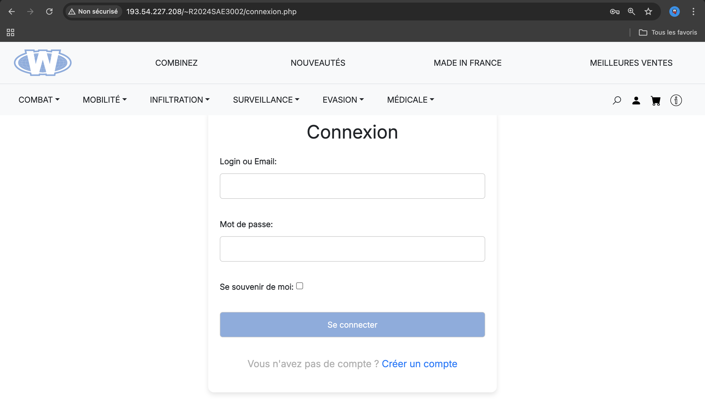
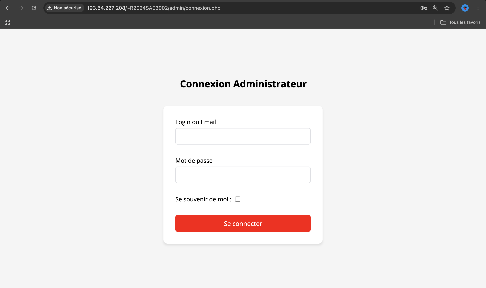

*IUT DE BLAGNAC*

*UNIVERSITE TOULOUSE II*

*SAE 3.01*

_BUT2 Informatique - Année Universitaire 2024 / 2025_

'''

// PAGE DE GARDE

// images
image::./img/logo_iut_blagnac.jpg[Logo IUT de Blagnac, 200]
image::./img/logo_univ_jean_jaures.jpg[Logo Université Toulouse II - Jean Jaurès, 200]

---

*Étudiants* +
Nolhan Biblocque +
Léo Guinvarc'h +
Victor Jockin +
Mathys Laguilliez +
Mucahit Lekesiz

*Enseignants* +
Jean-Michel Bruel +
Esther Pendaries

*Formation* +
BUT Informatique +
2ème Année +
Promotion 2024-2025 +

*Établissement* +
IUT de Blagnac, +
Université Toulouse II – Jean Jaurès (31)

---

= DOCUMENTATION UTILISATEUR SITE E-COMMERCE *WOOHP RESELL*

:Entreprise: Whoop Resell
:Equipe: G2b12
:docdate: {docdate}

== Sommaire
- <<I._Introduction, I. Introduction>>
- <<II._Présentation_générale, II. Présentation générale>>
- <<III._Installation_utilisation, III. Installation et utilisation>>
- <<IV._Fonctionnement, IV. Fonctionnement>>
- <<V._Résultats_produits, V. Résultats produits>>

---

== Introduction
[.text-justify]
L’entreprise *Woohp Resell*, fondée initialement par l’organisation WOOHP (World Organization Of Human Protection) a entrepris une démarche de digitalisation. Le développement d’un site d’E-commerce pour cette PME spécialisée dans la vente de gadgets d’espionnage et de technologies de sécurité s'inscrit dans cette volonté d’élargir son marché en se faisant connaître auprès du grand public et ainsi assurer la continuité de son héritage. .

== 1. Présentation générale
[.text-justify]
Le site e-commerce de l'entreprise *Woohp Resell* propose une interface intuitive permettant aux utilisateurs d’explorer une large gamme de produits, de les ajouter à leur panier, et de passer des commandes en toute sécurité.

== 2. Installation
[.text-justify]
Ci-dessous les instructions étape par étape pour installer et configurer le site, suivies des bases pour l'utiliser efficacement.

== 3. Guide d'utilisation administrateur

=== 3.1 Accès au back-office

|===
>| *Identifiant (ID)*       5+| *F-03-01-01*
>| *Fonctionnalité*         5+| Connexion au back-office
>| *Description*            5+| Connexion à l'espace d'administration du site e-commerce.
6+|
>| *Tutoriel réalisé par*   5+| Victor Jockin (VJ)
6+|
6+^| *Prérequis*
6+^| Aucun 
6+| 
6+^| *Étapes d'utilisation*
6+a|

*Étape 1 :* Accéder à au formulaire de connexion administrateur.

* Accéder à la page de connexion client du site.

* Dans l'url, saisir la chaîne `admin/` avant la chaîne `connexion.php`. L'url devient alors http://193.54.227.208/~R2024SAE3002/admin/connexion.php.

* 

_*NOTE :*_ _Il est possible d'accéder dirèclement à l'espace administrateur en utilisant le lien suivant : http://193.54.227.208/~R2024SAE3002/admin/_

---

|===

|===
>| *Identifiant (ID)*       5+| *F-03-01-02*
>| *Fonctionnalité*         5+| Déconnexion du back-office
>| *Description*            5+| Déconnexion de l'espace d'administration du site e-commerce.
6+|
>| *Tutoriel réalisé par*   5+| Victor Jockin (VJ)
6+|
6+^| *Prérequis*
6+a| 
|===